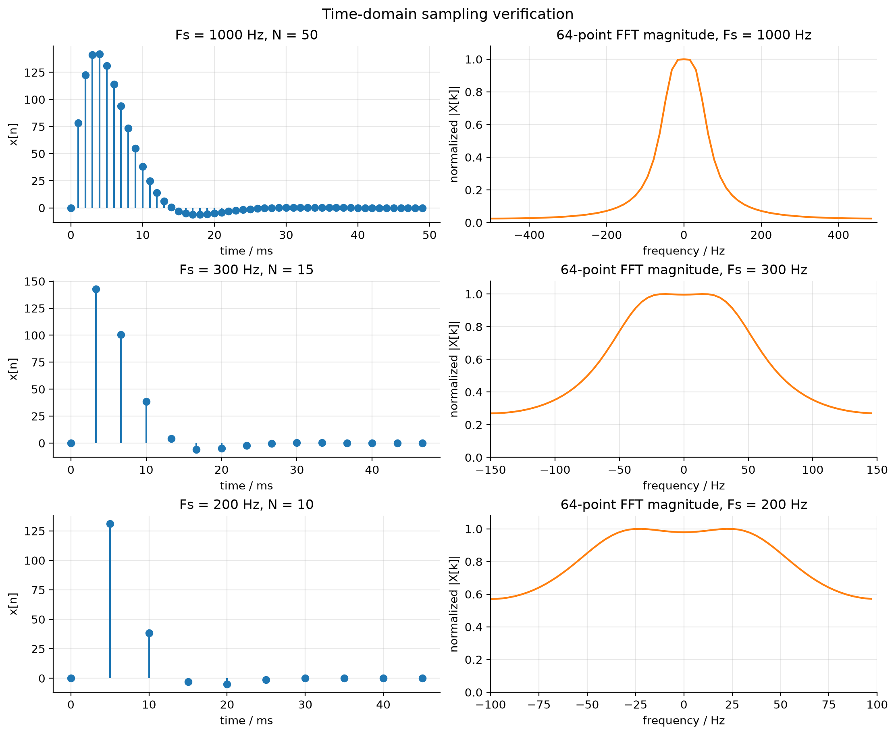
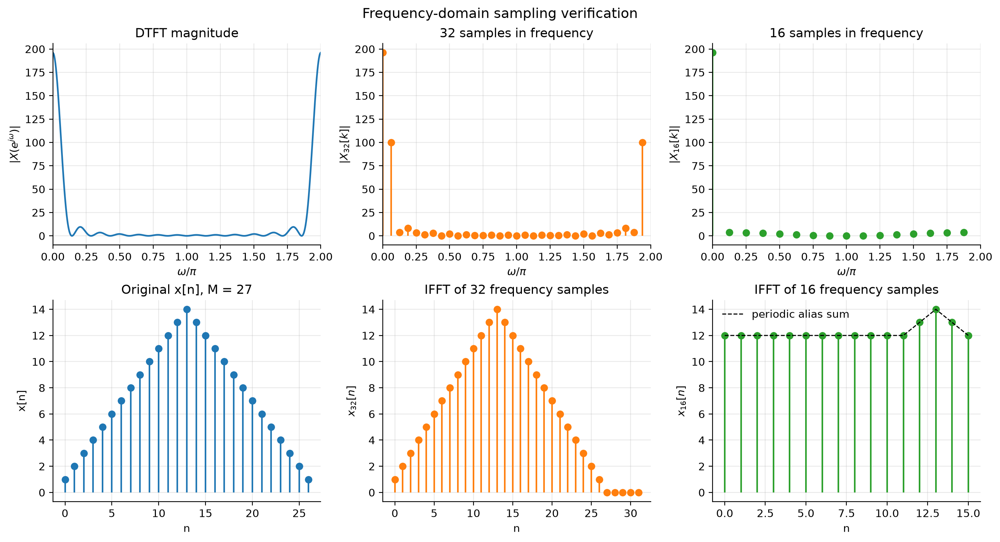

<h1 align="center">数字信号处理实验报告</h1>

姓名：傅粱训  
学号：24373088  
班级：242311  
日期：2026年6月

## 一、实验目的
本实验围绕时域采样和频域采样两个基本理论展开。通过对模拟信号进行不同采样频率下的离散化和 FFT 分析，观察采样前后频谱的变化，理解采样频率不足时产生频谱混叠的原因。通过对有限长序列频谱进行 32 点和 16 点等间隔采样，并分别作 IFFT，验证频域采样会导致时域序列按采样点数进行周期延拓；当频域采样点数小于原序列长度时，时域会发生混叠失真。

## 二、实验原理

### 1. 时域采样定理

设模拟信号为 \(x_a(t)\)，以采样周期 \(T\) 进行理想采样，采样角频率为

\[
\Omega_s=\frac{2\pi}{T}
\]

理想采样信号可写为

\[
\hat{x}_a(t)=\sum_{n=-\infty}^{\infty}x_a(nT)\delta(t-nT)
\]

其频谱为原模拟信号频谱的周期延拓：

\[
\hat{X}_a(j\Omega)=\frac{1}{T}\sum_{m=-\infty}^{\infty}
X_a\left[j(\Omega-m\Omega_s)\right]
\]

因此，时域采样会使频域频谱以 \(\Omega_s\) 为周期重复。当采样角频率满足

\[
\Omega_s \ge 2\Omega_m
\]

其中 \(\Omega_m\) 为信号最高角频率时，采样后频谱不发生混叠，理论上可以由采样信号恢复原模拟信号。若采样频率不足，则周期延拓的频谱相互重叠，产生频谱混叠失真。

在计算机实验中，模拟信号经采样得到离散序列

\[
x(n)=x_a(nT)
\]

序列的 DTFT 与理想采样信号频谱之间满足变量替换关系：

\[
\omega=\Omega T
\]

因此可以用 FFT 近似观察采样序列的幅频特性。

### 2. 频域采样

对离散序列 \(x(n)\) 的频谱 \(X(e^{j\omega})\) 在 \([0,2\pi]\) 上等间隔采样 \(N\) 点：

\[
X_N(k)=X\left(e^{j\frac{2\pi k}{N}}\right),\quad k=0,1,\cdots,N-1
\]

对 \(X_N(k)\) 作 \(N\) 点 IDFT，得到

\[
x_N(n)=\text{IDFT}\{X_N(k)\}
=\sum_{r=-\infty}^{\infty}x(n+rN),\quad n=0,1,\cdots,N-1
\]

由此可知，频域采样会导致时域序列按 \(N\) 为周期进行延拓并在主值区相加。若原序列长度为 \(M\)，当 \(N\ge M\) 时不会发生时域混叠；当 \(N<M\) 时，不同周期的样值会叠加到同一主值区位置，产生时域混叠。

时域采样与频域采样具有对偶性：时域采样导致频域周期延拓，频域采样导致时域周期延拓。

## 三、实验内容与结果分析

### 1. 时域采样

实验给定模拟信号为

\[
x_a(t)=A e^{-\alpha t}\sin(\Omega_0 t)u(t)
\]

其中

\[
A=444.128,\quad \alpha=50\sqrt{2}\pi,\quad \Omega_0=50\sqrt{2}\pi\ \text{rad/s}
\]

取观测时间

\[
T_p=50\text{ ms}
\]

分别采用三种采样频率：

\[
F_s=1000\text{ Hz},\quad 300\text{ Hz},\quad 200\text{ Hz}
\]

采样序列长度按

\[
N=T_pF_s
\]

计算，得到如下结果：

| 采样频率 \(F_s\) | 采样点数 \(N\) | 奈奎斯特频率 \(F_s/2\) |
|---:|---:|---:|
| 1000 Hz | 50 | 500 Hz |
| 300 Hz | 15 | 150 Hz |
| 200 Hz | 10 | 100 Hz |

FFT 点数统一取 \(M=64\)，长度不足 64 的序列在尾部补零。实验曲线如下：



从图中可以看到：

1. 当 \(F_s=1000\text{ Hz}\) 时，采样点较密，奈奎斯特频率较高，采样后频谱在主频带内形状集中，未出现明显混叠。
2. 当 \(F_s=300\text{ Hz}\) 时，采样点数减少，频谱曲线明显变宽，频谱两侧的周期延拓成分开始对主频带产生影响，出现轻微混叠趋势。
3. 当 \(F_s=200\text{ Hz}\) 时，采样点数只有 10 点，奈奎斯特频率降低到 100 Hz，频谱周期延拓之间重叠明显，幅频特性发生较大变形，说明采样频率不足会造成频谱混叠。

由于该指数衰减正弦信号并不是严格带限信号，其频谱理论上有无限延伸的尾部，所以实际实验中应结合主要能量范围来判断混叠程度。采样频率越高，周期延拓频谱之间的间隔越大，混叠越弱；采样频率越低，频谱重叠越明显，恢复原信号越困难。

### 2. 频域采样

实验给定有限长序列

\[
x(n)=
\begin{cases}
n+1, & 0\le n\le 13\\
27-n, & 14\le n\le 26\\
0, & \text{其他}
\end{cases}
\]

该序列长度为

\[
M=27
\]

分别对 \(X(e^{j\omega})\) 在 \([0,2\pi]\) 上采样 32 点和 16 点，得到 \(X_{32}(k)\) 和 \(X_{16}(k)\)，再分别作 IFFT 得到 \(x_{32}(n)\) 和 \(x_{16}(n)\)。实验曲线如下：



从结果可以得到：

1. 当 \(N=32\) 时，\(N>M\)，因此 32 点 IFFT 得到的 \(x_{32}(n)\) 与原序列 \(x(n)\) 相同，只是在尾部补了 \(32-27=5\) 个零点，没有发生时域混叠。
2. 当 \(N=16\) 时，\(N<M\)，频域采样点数小于原序列长度，16 点 IFFT 得到的序列不是原序列的前 16 点，而是原序列按 16 为周期延拓后的主值区叠加结果：

\[
x_{16}(n)=\sum_{r=-\infty}^{\infty}x(n+16r),\quad n=0,1,\cdots,15
\]

计算得到

\[
x_{16}(n)=
[12,12,12,12,12,12,12,12,12,12,12,12,13,14,13,12]
\]

该结果与 16 点 IFFT 的输出一致，说明频域采样不足会在时域产生周期混叠。

## 四、实验结论

1. 时域采样会使模拟信号频谱按采样频率周期延拓。采样频率越高，频谱副本之间间隔越大，越不容易发生混叠；采样频率过低时，频谱副本相互重叠，采样后信号无法完整表示原信号。
2. 使用 FFT 分析采样序列时，FFT 点数决定频域显示的离散频率刻度，补零可以使频谱曲线显示更平滑，但不能增加原采样数据中实际包含的信息。
3. 频域采样会使时域序列周期延拓。若频域采样点数 \(N\ge M\)，IDFT 结果能保持原序列；若 \(N<M\)，IDFT 结果为原序列按 \(N\) 折叠后的叠加序列，会发生时域混叠。
4. 时域采样定理和频域采样定理体现了傅里叶变换中的对偶关系：一个域中的离散采样，会导致另一个域中的周期延拓。

## 五、思考题

题目：如果序列 \(x(n)\) 的长度为 \(M\)，希望得到其频谱 \(X(e^{j\omega})\) 在 \([0,2\pi]\) 上的 \(N\) 点等间隔采样，当 \(N<M\) 时，如何用一次最少点数的 DFT 得到该频谱采样？

答：

当 \(N<M\) 时，不能简单取原序列的前 \(N\) 点作 \(N\) 点 DFT，因为这样会丢掉后面的样值。正确方法是先将原序列按模 \(N\) 折叠相加，得到长度为 \(N\) 的周期混叠序列：

\[
x_N(n)=\sum_{r=-\infty}^{\infty}x(n+rN),\quad n=0,1,\cdots,N-1
\]

然后对 \(x_N(n)\) 作一次 \(N\) 点 DFT：

\[
X_N(k)=\sum_{n=0}^{N-1}x_N(n)e^{-j\frac{2\pi}{N}kn},
\quad k=0,1,\cdots,N-1
\]

即可得到所需的频谱采样值

\[
X_N(k)=X\left(e^{j\frac{2\pi k}{N}}\right)
\]

这里的一次 \(N\) 点 DFT 就是最少点数的 DFT，因为目标本身需要得到 \(N\) 个等间隔频域采样值。

## 六、程序

```python
import numpy as np
import matplotlib.pyplot as plt
from pathlib import Path


OUT_DIR = Path("figures")
OUT_DIR.mkdir(exist_ok=True)


def set_common_style():
    plt.rcParams.update(
        {
            "figure.dpi": 120,
            "savefig.dpi": 200,
            "axes.grid": True,
            "grid.alpha": 0.28,
            "axes.spines.top": False,
            "axes.spines.right": False,
            "font.size": 10,
        }
    )


def analog_signal_samples(fs, tp=0.05):
    a = 444.128
    alpha = 50 * np.sqrt(2) * np.pi
    omega0 = 50 * np.sqrt(2) * np.pi
    n = np.arange(int(round(tp * fs)))
    t = n / fs
    x = a * np.exp(-alpha * t) * np.sin(omega0 * t)
    return n, t, x


def plot_time_domain_sampling():
    fft_len = 64
    sample_rates = [1000, 300, 200]
    fig, axes = plt.subplots(3, 2, figsize=(11, 9), constrained_layout=True)

    for row, fs in enumerate(sample_rates):
        n, t, x = analog_signal_samples(fs)
        padded = np.zeros(fft_len)
        padded[: len(x)] = x
        spectrum = np.fft.fftshift(np.fft.fft(padded, fft_len))
        freq = np.fft.fftshift(np.fft.fftfreq(fft_len, d=1 / fs))
        mag = np.abs(spectrum)
        if mag.max() > 0:
            mag = mag / mag.max()

        ax_time = axes[row, 0]
        ax_freq = axes[row, 1]

        ax_time.stem(t * 1000, x, basefmt=" ", linefmt="C0-", markerfmt="C0o")
        ax_time.set_title(f"Fs = {fs} Hz, N = {len(x)}")
        ax_time.set_xlabel("time / ms")
        ax_time.set_ylabel("x[n]")

        ax_freq.plot(freq, mag, color="C1", linewidth=1.6)
        ax_freq.set_title(f"64-point FFT magnitude, Fs = {fs} Hz")
        ax_freq.set_xlabel("frequency / Hz")
        ax_freq.set_ylabel("normalized |X[k]|")
        ax_freq.set_xlim(-fs / 2, fs / 2)
        ax_freq.set_ylim(0, 1.08)

    fig.suptitle("Time-domain sampling verification", fontsize=13)
    fig.savefig(OUT_DIR / "time_domain_sampling.png", bbox_inches="tight")
    plt.close(fig)


def build_frequency_domain_sequence():
    n = np.arange(27)
    x = np.zeros_like(n, dtype=float)
    x[(0 <= n) & (n <= 13)] = n[(0 <= n) & (n <= 13)] + 1
    x[(14 <= n) & (n <= 26)] = 27 - n[(14 <= n) & (n <= 26)]
    return n, x


def periodize_to_length(x, period):
    folded = np.zeros(period, dtype=float)
    for i, value in enumerate(x):
        folded[i % period] += value
    return folded


def plot_frequency_domain_sampling():
    n, x = build_frequency_domain_sequence()

    x32 = np.zeros(32)
    x32[: len(x)] = x
    x16_alias = periodize_to_length(x, 16)

    x32_spec = np.fft.fft(x32, 32)
    x16_spec = x32_spec[::2]
    x32_ifft = np.fft.ifft(x32_spec).real
    x16_ifft = np.fft.ifft(x16_spec).real

    dense_n = np.arange(len(x))
    omega = np.linspace(0, 2 * np.pi, 1024, endpoint=False)
    dense_spec = np.array(
        [np.sum(x * np.exp(-1j * w * dense_n)) for w in omega]
    )

    fig, axes = plt.subplots(2, 3, figsize=(13, 7), constrained_layout=True)

    axes[0, 0].plot(omega / np.pi, np.abs(dense_spec), color="C0", linewidth=1.6)
    axes[0, 0].set_title("DTFT magnitude")
    axes[0, 0].set_xlabel(r"$\omega/\pi$")
    axes[0, 0].set_ylabel(r"$|X(e^{j\omega})|$")
    axes[0, 0].set_xlim(0, 2)

    k32 = np.arange(32)
    axes[0, 1].stem(
        2 * k32 / 32,
        np.abs(x32_spec),
        basefmt=" ",
        linefmt="C1-",
        markerfmt="C1o",
    )
    axes[0, 1].set_title("32 samples in frequency")
    axes[0, 1].set_xlabel(r"$\omega/\pi$")
    axes[0, 1].set_ylabel(r"$|X_{32}[k]|$")
    axes[0, 1].set_xlim(0, 2)

    k16 = np.arange(16)
    axes[0, 2].stem(
        2 * k16 / 16,
        np.abs(x16_spec),
        basefmt=" ",
        linefmt="C2-",
        markerfmt="C2o",
    )
    axes[0, 2].set_title("16 samples in frequency")
    axes[0, 2].set_xlabel(r"$\omega/\pi$")
    axes[0, 2].set_ylabel(r"$|X_{16}[k]|$")
    axes[0, 2].set_xlim(0, 2)

    axes[1, 0].stem(n, x, basefmt=" ", linefmt="C0-", markerfmt="C0o")
    axes[1, 0].set_title("Original x[n], M = 27")
    axes[1, 0].set_xlabel("n")
    axes[1, 0].set_ylabel("x[n]")

    axes[1, 1].stem(
        np.arange(32),
        x32_ifft,
        basefmt=" ",
        linefmt="C1-",
        markerfmt="C1o",
    )
    axes[1, 1].set_title("IFFT of 32 frequency samples")
    axes[1, 1].set_xlabel("n")
    axes[1, 1].set_ylabel(r"$x_{32}[n]$")

    axes[1, 2].stem(
        np.arange(16),
        x16_ifft,
        basefmt=" ",
        linefmt="C2-",
        markerfmt="C2o",
    )
    axes[1, 2].plot(
        np.arange(16),
        x16_alias,
        "k--",
        linewidth=1,
        label="periodic alias sum",
    )
    axes[1, 2].set_title("IFFT of 16 frequency samples")
    axes[1, 2].set_xlabel("n")
    axes[1, 2].set_ylabel(r"$x_{16}[n]$")
    axes[1, 2].legend(frameon=False)

    fig.suptitle("Frequency-domain sampling verification", fontsize=13)
    fig.savefig(OUT_DIR / "frequency_domain_sampling.png", bbox_inches="tight")
    plt.close(fig)

    return x16_alias, x16_ifft


def main():
    set_common_style()
    plot_time_domain_sampling()
    x16_alias, x16_ifft = plot_frequency_domain_sampling()
    print("Generated figures:")
    print(f"- {OUT_DIR / 'time_domain_sampling.png'}")
    print(f"- {OUT_DIR / 'frequency_domain_sampling.png'}")
    print("x16 periodic alias sum:")
    print(np.round(x16_alias, 6))
    print("x16 from IFFT:")
    print(np.round(x16_ifft, 6))


if __name__ == "__main__":
    main()
```
